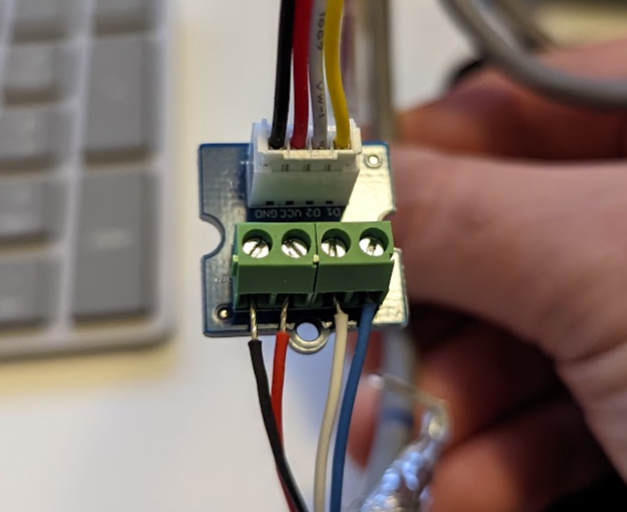

# Water Storage Monitor

This sample illustrates using a distance sensor to monitor the fill volume of a water storage container such as a well, or a rain barrel.

It also illustrates how to use multiple configurations, i.e. a bench hardware setup and a lab hardware setup, in a single application, and easily switch between the hardware setups.

## Hardware Setups

Currently, the application supports two hardware setups:
 * **Bench Prototype** - Utilizes a VL53L0X Time-of-Flight (ToF) sensor to model a real world water storage sensor.
 * **Lab Prototype** - Utilizes a MaxBotix sensor and a rain barrel.

To switch between the two configurations, edit the `MeadowApp.cs` file, line 24:

```csharp
HardwareConfigTypes currentHardwareConfig = HardwareConfigTypes.LabProto;
```

### Bench Hardware Configuration

#### BoM

* (1) Project Lab board
* (1) [VL53L0X distance sensor](https://www.adafruit.com/product/5425)
* (1) [STEMMA QT Cable](https://www.adafruit.com/?q=Stemma+Cabler&sort=BestMatch)

#### Assembly

1. Plug the distance into the STEMMA QT/QWIIC (bottom) connector on the Project Lab board using the STEMMA QT cable.

### Lab Hardware Configuration

#### BoM

* (1) Project Lab board
* (1) [MaxBotix MB7850 XL-TankSensor-WRMA](https://www.maxbotix.com/ultrasonic_sensors/mb7850.htm) distance sensor
* (1) [Grove Screw Terminal](https://www.seeedstudio.com/Grove-Screw-Terminal.html)
* (1) [Seeed Studio Grove Cable](https://www.seeedstudio.com/catalogsearch/result/?q=Grove%20Cable)
* (1) 55gal Water Barrel

#### Assembly

1. Connect the MaxBotix sensor to the screw terminal: 
     
    | MaxBotix Wire Color | Grove Wire Color |
    |---------------------|------------------|
    | Black | Black |
    | Red | Red |
    | White | White |
    | Blue | Yellow |
2. Plug the grove screw terminal cable into the Grove UART (middle) connector on the Project Lab board.
